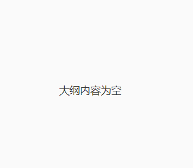

## Markdown方法

[hexo文档链接](https://hexo.io/zh-cn/docs/asset-folders)

没有使用hexo的tag，直接用markdown的语法

### 修改typora偏好设置

在typora的偏好设置中，设置图片插入路径


### 修改_config.yml

在_config.yml文件中设置post_asset_folder: true

<div>
    
</div>


### 复制或保存图片

将图片复制到typora里就可以正常显示在博客上了

如果是保存的图片要存到markdown文件的文件名对应的同级文件夹下，然后在markdown文件里写插入图片的语法，比如在`在hexo中插入图片.md`中插入`在hexo中插入图片`文件夹下的图片：

```

```


也可以写html代码来显示图片：

```html
<div>
	
</div>
```


